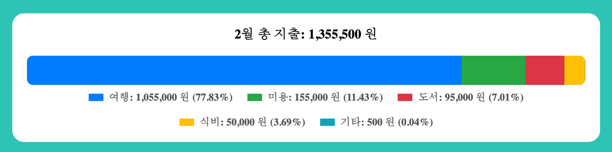
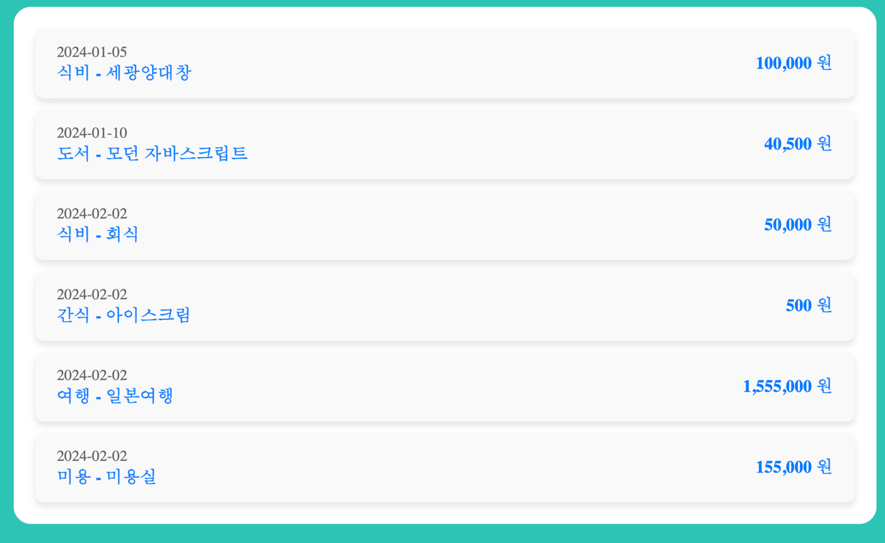

## ☝ 필수 구현 사항
- 지출 CRUD 구현 (작성, 조회, 수정, 삭제)
- 월별 지출 조회 기능 구현 (Home - Read)
- 월별 지출 항목 등록 구현 (Home - Create)
- 지출 상세 화면 구현 (Detail - Read)
- 상세화면에서 지출 항목 수정 구현 (Detail - Update)
- 상세화면에서 지출 항목 삭제 구현 (Detail - Delete)

<br />

**필수 요구 사항!  아래 내용을 꼭 지켜면서 구현해 주세요!**
- [ ]  styled-components 를 이용하여 스타일링
    - 인라인 스타일링이나 일반 css 파일을 이용한 스타일링 방식 지양 (이번 과제 한정)
    - 모든 태그를 styled-components 화 할 필요는 없으나 스타일링이 들어가는 경우는 styled-components 화 할 것
- [ ]  styled-components에 props를 넘김으로 인한 조건부 스타일링 적용
    - 월 선택 탭에 적용해 보세요
- [ ]  react-router-dom 을 이용해서 페이지 전환을 합니다.
    - 지출을 수정하기 위한 페이지 이동 시에 사용해주세요.
- [ ]  useState, useEffect, useRef 사용
    - 과제 안내 순서에 각각 어디에서 사용되면 좋을지 가이드를 드렸습니다. 해당 부분에서 위의 기능들을 각각 사용해주세요
- [ ]  지출 항목 등록 시 id는 uuid 라이브러리를 이용 
(npm i uuid) or (yarn add uuid)
    https://www.npmjs.com/package//uuid

<br>
<br>

## 📌 과제 진행 순서 안내

아래 순서대로 진행하시는 것을 권장 드립니다. 본인이 할 수 있는 항목까지 최대한 도전해 보세요!

- [ ]  (1) 프로젝트 셋업
    - Vite 를 이용해서 리액트 프로젝트를 셋업.
    - pages/ , components/ 폴더 작성 및 필요 컴포넌트 사전 작성
    - styled-components, react-router-dom 설치
    - index.html에 있는 title 변경
- [ ]  (2) “props-drilling” 브랜치 생성 및 이동
    
    Remind: props-drilling 브랜치에서는 context 나 redux는 사용하지 않습니다!
    
    ```bash
    git checkout -b props-drilling
    ```
    
- [ ]  (3) Router 셋업
    - react-router-dom을 이용하여 홈화면과 상세화면에 대한 라우터 설정을 해주세요.
- [ ]  (4) 전역스타일링 적용
    - styled-components 를 이용해 주세요. (App.css, index.css 는 삭제하셔도 좋습니다.)
    - reset.css 코드 적용
- [ ]  (5) 홈 화면 UI: 배너 및 헤더 파트 UI 구현
    - 상세요구사항 : 월 선택 탭에서 월을 클릭했을 때 어떤 탭이 활성화되었는지 styled-components의 조건부 스타일링을 적용해 보세요.
        
- [ ]  (6) 홈 화면 UI: Dummy Data(fakeData.json)를 이용한 리스트 UI 구현
    - fakeData.json
        
        참고:  제공해 드린 fakedata 와 같은 형식을 이용하실 필요는 없습니다. 자유롭게 데이터 형식을 택하셔도 무방합니다. 
        
        ```json
        [
            {
              id: "25600f72-56b4-41a7-a9c2-47358580e2f8",
              date: "2024-01-05",
              item: "식비",
              amount: 100000,
              description: "세광양대창",
            },
            {
              id: "25600f72-53b4-4187-a9c2-47358580e2f8",
              date: "2024-01-10",
              item: "도서",
              amount: 40500,
              description: "모던 자바스크립트",
            },
            {
              id: "24310f72-56b4-41a7-a9c2-458580ef1f8",
              date: "2024-02-02",
              item: "식비",
              amount: 50000,
              description: "회식",
            },
            {
              id: "25600f72-99b4-41z7-e4h6-47312365e2f8",
              date: "2024-02-02",
              item: "간식",
              amount: 500,
              description: "아이스크림",
            },
            {
              id: "25143e72-16e2-22a7-a9c2-47358580e2f8",
              date: "2024-02-02",
              item: "여행",
              amount: 1055000,
              description: "일본여행",
            },
            {
              id: "25600f72-97p2-14a7-a9c2-47363950e2t8",
              date: "2024-02-02",
              item: "미용",
              amount: 155000,
              description: "미용실",
            },
                {
              id: "24312f70-97q2-14a7-a9c2-47132950e2t8",
              date: "2024-02-02",
              item: "도서",
              amount: 75000,
              description: "자율주행차량 운전주행모드 자동 전환용 인식률 90% 이상의 다중 센서 기반 운전자 상태 인식 및 상황 인식 원천 기술 개발",
            },
          ]
        ```
        
    - 상세요구사항
        
        1) 지출 내역은 딱 한 줄까지만 표현하고 한 줄이상의 컨텐츠일 경우 … 으로 표현하세요.
        
        2) 각 월별에 맞는 데이터를 보여주세요.
        
        로컬 스토리지를 사용하여 마지막으로 선택된 '월'을 저장하고, 해당 페이지가 다시 시작 될 때마다 해당 값을 불러옵니다. **`useEffect`**를 사용하여 월이 변경될 때마다 로컬 스토리지에 값을 저장합니다.
        
- [ ]  (7) 지출 항목 입력창 작성하여 지출 항목 등록 기능 구현
    - 상세요구사항
        
        1)  날짜, 항목, 금액, 내용을 입력하고 지출 항목을 등록하세요.
        
        2) 날짜와 금액에 대해 유효성 검사를 적용해 주세요.
        
        3) 지출 등록 시 id는 uuid 라이브러리를 이용해 생성합니다.
        
        참고:  제공해 드린 fakedata 와 같은 형식을 이용하실 필요는 없습니다. 자유롭게 데이터 형식을 택하셔도 무방합니다. 
        
- [ ]  (8) 홈화면의 지출 항목 클릭 시 상세화면으로 이동 구현
    - 상세화면 이동 시 클릭한 지출 항목의 id값을 가지고 이동해 주세요.
- [ ]  (9) 지출 수정화면 UI 구현
    - 상세요구사항
        
        1) 지출을 수정할 수 있는 UI 표현해 주세요.
        
        2) 수정할 값을 받는 <Input> 을 만들 때 useRef 를 사용해주세요.
        
        3) 수정, 삭제, 뒤로가기 기능을 넣어주세요.
        
        참고:  UI는 자유롭게 구성해주세요.
        
        4) 수정 버튼을 누르면, 기존 지출의 데이터를 수정하고 ‘홈’ 으로 이동합니다. 수정된 변경사항이 바로 적용이 되어야 합니다.
        
        5) 삭제 버튼 클릭 시 즉시 삭제하기 보다는 사용자에게 확인받은 뒤 삭제처리 하도록 해주세요. 삭제 이후에는 홈으로 이동시켜주세
        
- [ ]  (10) “context” 로 브랜치 생성 및 이동
    
    Remind: context 브랜치에서는 redux는 사용하지 않습니다!
    
    ```bash
    git checkout -b context
    ```
    
- [ ]  (11) props drilling으로 불편하게 관리하던 state를 context api 로 리팩터링
    - 전체 지출 state 는 context 전역상태로 변경합니다. 이외에도 전역상태 관리하고 싶은 상태가 있으면 자유롭게 context 로 관리해 줍니다.
- [ ]  (12) “redux” 로 브랜치 생성 및 이동
    
    Remind: redux 브랜치에서는 context 없이 redux만 사용합니다!
    
    ```bash
    git checkout -b redux
    ```
    
- [ ]  (13) context 로 관리중이던 모든 것을 redux 로 리팩터링
    - Redux-toolkit 을 사용해 리덕스를 구성해 주세요. (ducks 패턴은 사용하지 않습니다.)
- [ ]  (14) 13단계까지 모두 완료하셨다면 선택구현사항들에 도전해 보시면 되겠습니다!

<br>
<br>

## 👌 선택 구현 사항 
- 모달 구현
    - window.alert 이나 window.confirm 대신 직접 구현한 모달을 적용해 봅시다.
- 월별 지출 Summary
    - 월별 지출 상세를 정리해주는 UI 를 만들어 봅니다.
    
    
- 지출 데이터 정렬
    - Sort 로직을 작성하여 데이터를 시간순 혹은 종류별로 정렬해 봅시다.
    
    
    
- src 폴더 기준 절대경로 설정 (vite.config.js)  ex)   ../../../../../components/buttons.js  ⇒  @/components/button.js

<br>
<br>

## ❓ 아래 질문에 대한 답변을 함께 제출해 주세요.

1. styled-components 는 CSS in JS 라이브러리 중 하나로 리액트 개발 시 자주 사용되는 방법입니다. 본인이 생각하는 styled-components의 장점과 단점을 말씀해 주세요.
2. props-drilling으로 전체를 먼저 구현하신 다음 context api와 redux로 리팩터링해서 전역 상태 관리를 경험해 보셨습니다. 어떤 상태들을 전역 상태로 관리하셨나요? context나 redux로 전역상태를 관리해봤을 때 어떤 문제를 해결해준다고 느끼셨나요?
3. 지출을 등록/수정 하는 과정에서 useState 와 useRef 를 둘다 사용해봤는데요. 각각 언제 사용하면 좋을 지에 대한 생각을 공유해주세요.